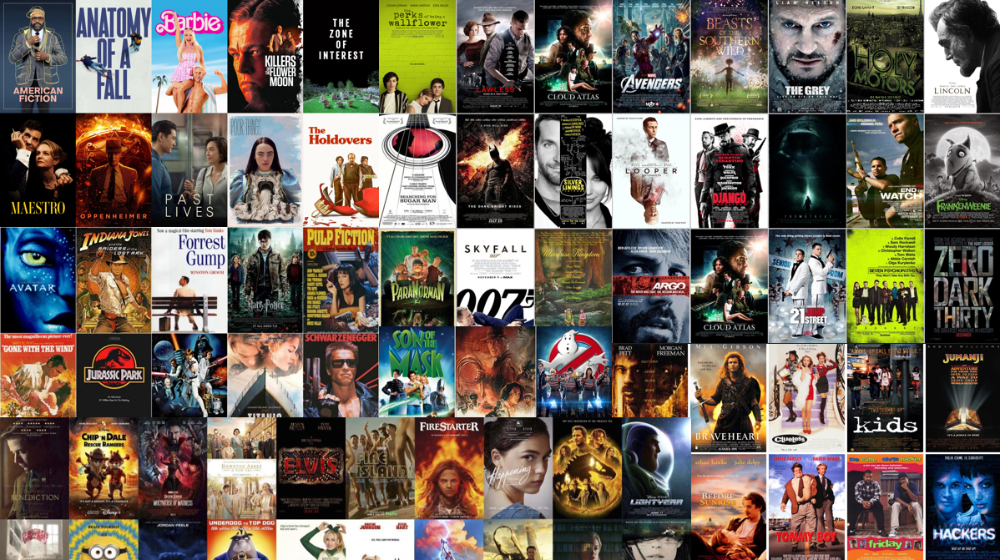
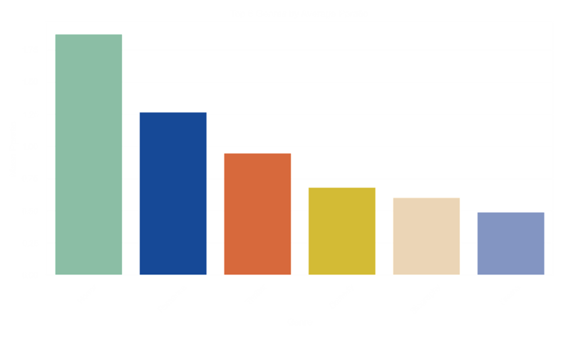
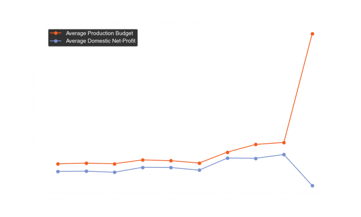
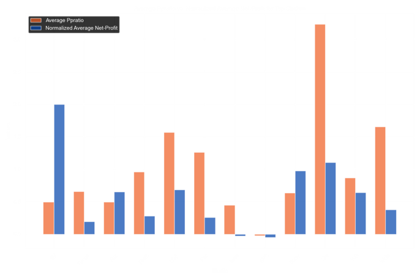

# Genre Profitability of Feature Films



### Analysis Overview

This project analyzes several box office movie data sources in the form of database and csv files. Assessing a variety of metrics surrounding the movie industry we will address the Business Problem outlined below, and make recommendations based on this data.

### Business Problem

Our company now sees all the big companies creating original video content and they want to get in on the fun. They have decided to create a new movie studio, but they don’t know anything about creating movies.

- We are charged with exploring what types of films are currently doing the best at the box office.
- We must then translate those findings into actionable insights that the head of your company's new movie studio can use to help decide what type of films to create.


### Data

Several data sources were used in the analysis that follows. Due to size constraints of these data sources, we are not able to store the raw data in the online repository where this analysis resides. If the reader wishes to explore those data sets or run the code within the notebook file, it will be necessary to find the sources online and download them. These sources include:

- im.db (IMDB)
- bom.movie_gross.csv (Box Office Mojo)
- rt.movie_info.tsv (Rotten Tomatoes)
- rt.reviews.tsv (Rotten Tomatoes)
- tmdb.movies.csv (TheMovieDB)
- tn.movie_budgets.csv (The Numbers)

### Methods


This project uses descriptive analysis and hypothesis testing to identify and evaluate features of movies that are most profitable:
- Over 100k movies were analyzed
- Features analyzed include genre, runtime, release year, directors, actors, writers, ratings, budget and gross revenue
- Data was cleaned and imputed with regard to missingness and outliers
- Key performance indicator was profit-to-production ratio (ppratio), defined as (gross revenue - budget cost) / budget cost


### Results
Some key results of the analyses are presented here.  For full analyses see links to the notebook and presentation in the 'More Info' section below.

Here are the top 6 genres average ppratio, showing Horror as the top genre


The budget and net-profit trend since 2018 indicates there is potential risk in Comedy genre:


Here we see that Universal Studio and Lionsgate production companies are the best choices to work with based on ppratio and net-profit:


The top 15 Directors with the highest mean ppratio are compared to the rest of the field and presented in the graphs below. Similar analyses were performed for Writers and Actors, and are provided in the conclusions below.

---


---


---

# Conclusions

Based on the analysis, a movie project with the highest potential for increased ppratio (see definition in 'Methods' above) will include these features:

- Length: Feature Film (40+ Minutes)
- Genre: Horror (Subgenre: Horror-Thriller)
- Studio: Universal (Runner-up: Lionsgate)
- Release Month: February
- Directors, Writers, Actors:
    - Preference placed on historically high ppratio performers:
        - Directors:
            - James Wan, Christopher Landon, David O. Russell, Tim Story, Steven Soderberg, 
            - Will Gluck, Paul Feig, Nicholas Stoller, Jon M. Chu, 
            - John Madden, Tyler Perry, Jonathan Levine, Clint Eastwood, Francis Lawrence, Jaume Collet-Serra
        - Writers:
            - Oren Peli, Christopher Landon, James DeMonaco, Damien Chazelle, Eli Roth,
            - Scott Derrickson,Michael H. Weber, Scott Neustadter,Ken Daurio,Cinco Paul,Stephen King,
            - Jonah Hill, Suzanne Collins, Stephen Susco, Ryan Engle
        - Actors:
            - Octavia Spencer, Catherine Keener, Rose Byrne, Ethan Hawke, Mahershala Ali, 
            - Michael B. Jordan, Patrick Wilson, Naomie Harris, Gabrielle Union, Olivia Munn, 
            - Lena Headey, Frank Grillo, Mary Elizabeth Winstead, John Corbett, Michael Ealy
​

# Next Steps
- Investigate pursuing a relationship with Blumhouse Productions, a driving force in horror, producing over 200 movies and TV-series with theatrical grosses of almost $6 million in global box office
- Investigate pursuing a Production/Distribution agreement with Universal Studios
- Attend movie festivals to make business connections, i.e. Sundance, TIFF, Cannes, Telluride, Venice, Berlin, Tribeca
- Investigate potential business roadblocks concerning SAG-strike, Sales Agents, Theatrical-Release, Streamers


## For More Information

To see the full data analysis check out the [Jupyter Notebook](./Movies_EDA_Notebook.ipynb) or review the [presentation](./Movies_EDA_Presentation.pdf)

For any additional questions contact Emma Scotson or Dale DeFord

Emma Scotson: emmascotson112@gmail.com

Dale Deford: daledeford@gmail.com


## Repository Structure

```
├── images
├── README.md
├── Movies_EDA_Presentation.pdf
└── Movies_EDA_Notebook.ipynb
```


```python

```
